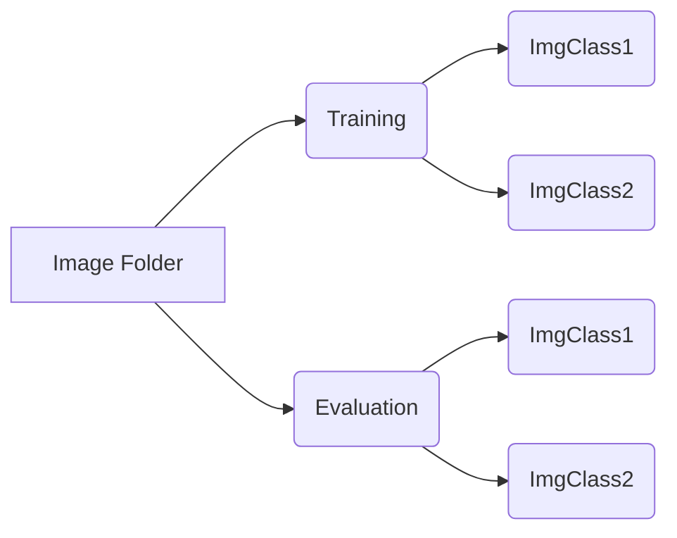

# Tutoriel  de prise en main

Ce tutoriel est destiné à faciliter la compréhension du 
**réseau de neurones**, sa prise en main, ainsi que sa réutilisation.
Il y est aussi détaillé, l'utilisation du réseau sur un robot **Pepper**.
Vous trouverez aussi une aide pour la **collecte de données**, nécessaire à l'entraînement du réseau.  

## Composition du projet

le projet est composé:

* D'un **réseau de neurones** à convolution pré-entraîné. `PepperNet.py`
* D'un **script** facilitant l'acquisition de nouvelles données`gatheringPic.py`
* D'un **programme** permettant d'exploiter le réseau depuis un robot Pepper.
* Et enfin de ce **wiki**, facilitent l'utilisation de tout cela.
* D'un script qui permet de tester le réseau en lui fournissant une image `PepperVision.py`.
* De 2 petits **jeux de données**.

## Acquisition de données

le script `gatheringData.py`, permettant la collecte de données, requiert un fichier contenant les *URL*  des images pour fonctionner.
Nous allons donc:

1. Récupérer les **URL** dans un fichier **txt**.
2. Utiliser le script pour télécharger les **images** depuis les **URL**.

### 1. Récupération des URL dans un fichier

Pour la première étape il suffit simplement d’effectuer une recherche [Google Image](https://www.google.fr/imghp?hl=fr&tab=wi&authuser=0) scrollez la  page tout en veillant à ce que les résultats restent **pertinents**.

Pour la seconde étape nous allons devoir effectuer quelques manipulations en **Javascript** dans la console du navigateur.
>pour ouvrir la console:

- sur **Chrome**: `Ctrl+Shift+J`
- sur **Firefox**:  `outils > développement web > outils de développement`

>puis entrez les lignes suivantes:

	var script = document.createElement('script');
	script.src = "https://ajax.googleapis.com/ajax/libs/jquery/2.2.0/jquery.min.js";
	document.getElementsByTagName('head')[0].appendChild(script);

cela nous permets maintenant d'utiliser *jquery*
>nous pouvons maintenant utiliser le selecteur CSS pour accéder aux URL. Pour cela:

	var urls = $('.rg_di .rg_meta').map(function()  {  return  JSON.parse($(this).text()).ou;  });

>nous récupérons maintenant les URL dans un fichier:

	var textToSave =  urls.toArray().join('\n');
	var hiddenElement = document.createElement('a');
	hiddenElement.href = 'data:attachment/text,'  +  encodeURI(textToSave);
	hiddenElement.target = '_blank';
	hiddenElement.download = 'urls.txt';
	hiddenElement.click();

### 2. Utilisation du script

L'utilisation du script est très simple cependant, il est parfois nécessaire
de télécharger certaines libraires python.  

>Commencer par ouvrir un terminal

sur **Linux**: `Ctrl+Alt+T`
puis: `python --version`

>vérifier que la version est supérieure à `3.5`.

Pour ce qui est de la gestion des librairies *python* tout au long du projet,
nous vous recommandons [d'installer](https://conda.io/docs/user-guide/install/download.html) l’environnement **Conda**.
Conda facilite grandement la gestion des bibliothèques et des dépendances python.

>le script python `gatheringPic.py` requiert 2 arguments.
* Le chemin du fichier `urls.txt` précédemment téléchargé.
* Le chemin de destination des images.

>on l’exécute de cette manière:

	python gatheringPic.py --urls path/of/urls.txt --output path/of/output/

Si des erreurs sont rencontrées pendant l’exécution du script, elles sont sûrement dues à des *librairies manquantes*.
Le cas échéant:
>Utilisez **pip** ou **conda** pour installer les dépendances manquantes.  
	`pip install`
	ou
	`conda install`

Bien sure, pour la suite, vous devrez traiter les images avant d’entraîner le réseau sur le **dataset**, certains résultats de *Google images* sont impertinents.
Par ailleurs:
>Les images utilisées lors de la ***phase d'évaluation*** doivent ***impérativement*** être ***inconnues*** pour le réseau ! Elles ne doivent en aucun cas faire partie du ***set d’entraînement***. 

## Réseau de neurones 

Pour pouvoir utiliser le réseau de neurones, veillez à avoir installez ***PyTorch*** sur votre machine, si ce n'est pas le cas, rendez vous sur le [site officiel de PyTorch]([https://pytorch.org/](https://pytorch.org/)).

  

### Entraînement du réseau de neurones

Pour entraîner le réseau à classifier des images, il est au préalable indispensable de créer un dossier contenant les images de **chaque classe**, 
pour les phases d'entraînement et d'évaluation ( Cf. Schéma ci-dessous ).

Une fois ce dossier rempli d'images, le fichier python permettant l'entraînement du réseau est `PepperNet.py`.

Pour utiliser ce programme veillez à paramétrer les trois variables suivantes :

- `imgFolder` définit quel dossier sera utilisé pour **entraîner le réseau**, veillez à mettre ce dernier à la **racine du projet**.

- `nameTrainingFolder` doit renseigner le nom du sous-dossier contenant les images de la **phase d'entraînement**.

- `nameEvaluationFolder`doit renseigner le nom du sous-dossier contenant les images de la **phase d'évaluation**.

Le morceau de code ci-dessous permet de configurer le *data loader*.

	loader = {x: torch.utils.data.DataLoader(imgDataset[x], batch_size=25, shuffle=True, num_workers=0) for x in [nameTrainingFolder, nameEvaluationFolder]}

- `Batch_size` définit le *nombre d'images* du jeu de données à faire passer dans le réseau en une fois

- `Shuffle` permet de pouvoir *itérer différemment* sur le data set à chaque passe

- `num_worker` définit le *nombre de sous-processus* à utiliser pour le chargement des données

>Les paramètres importants: 

	optimizer_conv = optim.SGD(pepperNet.fc.parameters(),lr=0.0001, momentum=0.9)
> **L'optimizer** prends deux paramètres :
> - **learning rate**: Le learning rate permet de définir à quel point nous allons ajuster les poids de notre réseau ( Plus ce dernier est haut, plus la précision augmentera vite, cependant un learning rate trop haut peut empêcher d'atteindre une précision maximale)
**[Voir l'article suivant](http://mlexplained.com/2018/01/29/learning-rate-tuning-in-deep-learning-a-practical-guide/)**.
> - **momentum**: il s'agit de garder en tête que l'objectif du réseau et de ***minimiser les erreurs***. la fonction tâtonne donc à trouver un minimum. le *momentum* nous évite de rester coincé dans un minimum local. Plus d'informations **[ici](https://pytorch.org/docs/stable/optim.html)** et **[ici](http://www.cs.toronto.edu/%7Ehinton/absps/momentum.pdf)**.

le lr_sheduler change le learning rate après les epochs,nous avons opté pour un sheduler simple, ce dernier multiplie le learning rate par Gamma tout les step_size epochs.

	exp_lr_scheduler = lr_scheduler.StepLR(optimizer_conv,step_size=6, gamma=0.1)
>**lr_sheduler**: le lr_sheduler change le learning rate après les epochs,nous avons opté pour un sheduler simple, ce dernier multiplie le learning rate par Gamma tout les step_size epochs.
>Plus d'info **[ici](https://pytorch.org/docs/stable/optim.html)**

	model_conv = train_model(pepperNet, criterion, optimizer_conv, exp_lr_scheduler, num_epochs=6)
>**num_epochs**: *num_epochs* correspond simplement au *nombre de passages* du réseau sur le data set pendant la phase d'apprentissage.
>Ici il est égale à 6.
>Nous vous conseillons de jouer sur ce paramètre pour palier au problème **d'overfitting**. Le réseau entraîné est ensuite récupéré dans *model_conv*.

### Comment sont définies les sorties du réseau ?

Les sorties de notre réseau sont définies par `peppernet.fc` qui n'est autre que la **dernière couche** du réseau et comporte donc ***autant*** de sorties que l'on a de classes d'images dans notre jeu de données.

	nbInput = pepperNet.fc.in_features
	pepperNet.fc = nn.Linear(nbInput, len(imgDataset)+1)

### Identification d'une image grâce au réseau de neurones

Pour procéder à **l'identification d'une image**, il faut utiliser la fonction `identify` présente dans `PepperVision.py`, cette dernière permet d'utiliser un réseau de neurones pour identifier une image.

  

Les paramètres sont les suivants :

  

- `imgPath` doit indiquer le chemin de l'image.

- `model` doit fournir un réseau de neurones, pour charger un réseau utiliser la fonction `toarch.load`, cependant si le réseau a été entraîné sur un GPU, et que l'on souhaite l'utiliser avec un CPU il faudra utiliser l'argument `map_location` afin que cela fonctionne.

>[Voir documentation officielle Pytorch]([https://pytorch.org/docs/stable/torch.html?highlight=load#torch.load](https://pytorch.org/docs/stable/torch.html?highlight=load#torch.load)).

- `itemList`doit fournir le nom des classes d'images que le réseau est capable de reconnaître ( Veillez à respectez l'ordre de ces classes )

- `treshold` *( optionnel )* indique le seuil en dessous duquel les images ne seront pas reconnues, la valeur par défaut est zéro.
  
>Exemple d'utilisation :
	
	list = ['imgClass1', 'imgClass2', 'imgClass3']
	model_conv = torch.load('NeuralNetwork')
	identify('TestImages/Chair.jpg', model_conv, list, 1.5)  
 